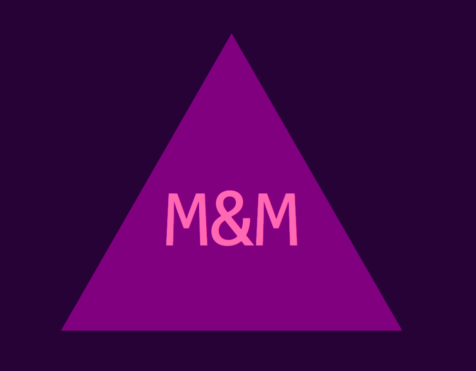

# Logo Maker

## Description
This application collects information from the user after they have been asked a series of questions. The answers to these questions are complied and used to make a logo that reflects the choices made by the user. 

Inquirer is used to collect input from the user in order to generate the logo file. The text, text color, shape, and shape color that the user chooses are recorded using inquirer and used to generate the logo based on input. Jest is used to run unit tests.

## Table of Contents
- [Installation](#installation)
- [Usage](#usage)
- [License](#license)
- [Contributing](#contributing)
- [Tests](#tests)
- [GitHub](#github)
- [Email](#email)
- [Instructions](#instructions)

## Installation
Install inquirer and jest to use the application.

## Usage
To generate an SVG file containing a logo based on user specification.

A walkthrough video demonstrating how a user would invoke the application from the command line as well as how to enter responses and the output of the application can be viewed <a href="https://" target="_blank">here</a>.

## License
MIT

## Contributing
Email me to learn how to contribute.

## Tests
Using [Inquirer](https://www.npmjs.com/package/inquirer/v/8.2.4), invoke it in the command line by using node index.js. To run the unit tests, use [Jest](https://www.npmjs.com/package/jest).

## GitHub
GitHub: https://github.com/caitlinramsey/logo-maker

## Email
Email: caitlinramsey@outlook.com

## Instructions 
Please email me at the address listed above.
